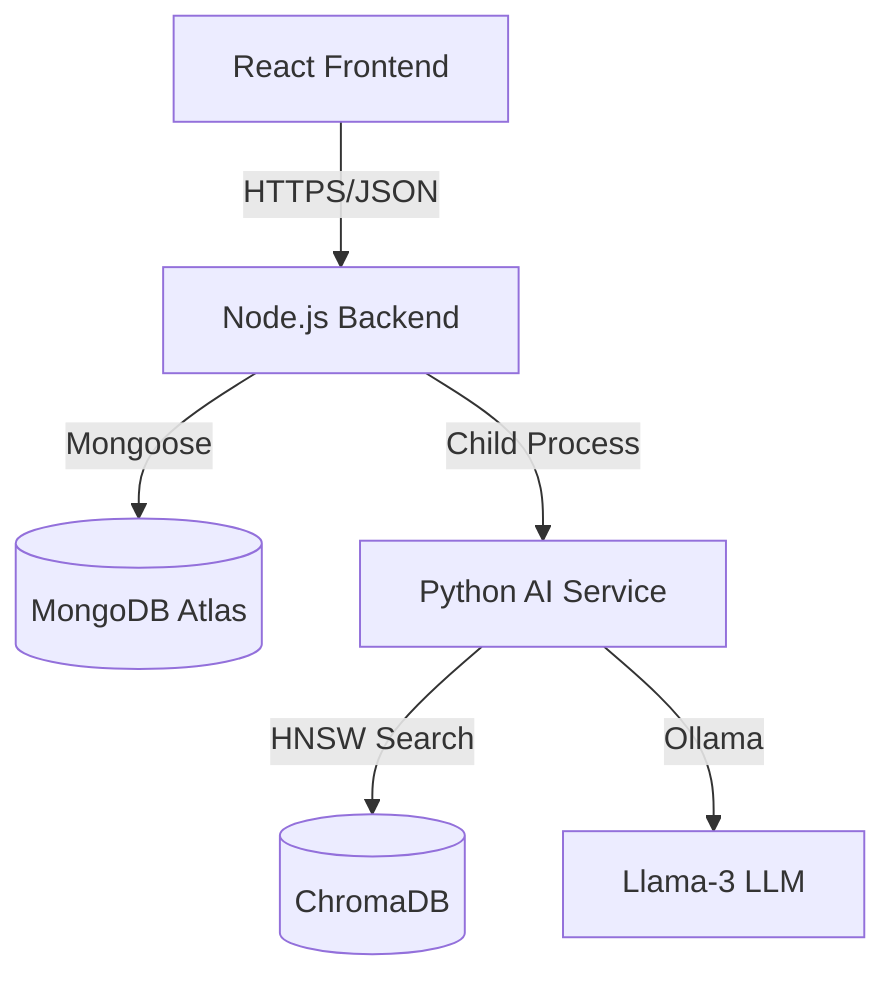

# CareerNavigator AI: System Architecture

## 1. Project Topology
A decoupled MERN-AI Hybrid architecture.



## 2. Folder Structure
```text
CareerNavigatorAI/
├── frontend/           # React + Vite SPA
│   ├── src/pages/      # View components (Dashboard, Assessment, etc.)
│   └── src/api.js      # Axios instance with Vercel routing
├── backend/            # Express.js API
│   ├── routes/         # Auth, Assessment, careers
│   ├── models/         # Mongoose Schemas (User, Career, Recommendation)
│   └── server.js       # Vercel-ready entry point
├── ai-service/         # Python Inference Engine
│   ├── inference.py    # RIASEC + NLP Matching
│   ├── ingest.py       # O*NET Competency Ingestion
│   └── venv/           # Isolated Python Environment
└── vercel.json         # Deployment & SPA Routing
```

## 3. API Endpoints
| Method | Endpoint | Description | Auth |
| :--- | :--- | :--- | :--- |
| POST | `/api/auth/register` | User Onboarding | No |
| POST | `/api/auth/login` | Session Initiation | No |
| GET | `/api/assessment/questions` | Fetch RIASEC Survey | No |
| POST | `/api/assessment/submit` | Store Psychometric Profile | Yes |
| GET | `/api/careers/recommendations` | Get History | Yes |
| POST | `/api/careers/match` | Run AI Inference (Python bridge) | Yes |
| POST | `/api/careers/:id/save` | Bookmark Career | Yes |

## 4. AI Service Integration
- **Mechanism**: Node.js `spawn()` calling `ai-service/venv/Scripts/python.exe`.
- **Communication**: JSON payload via `stdin`, Result via `stdout`.
- **Evaluation**: Calculates EVA (Alignment), RVI (Resilience), and SHAP (Importance).

## 5. Identified Integration Points
- Frontend → Backend: `/api` base URL.
- Backend → MongoDB: `MONGO_URI` (Atlas).
- Backend → AI: Child process execution of `inference.py`.
- AI → LLM: Local connection via `requests` to Ollama (Port 11434).
